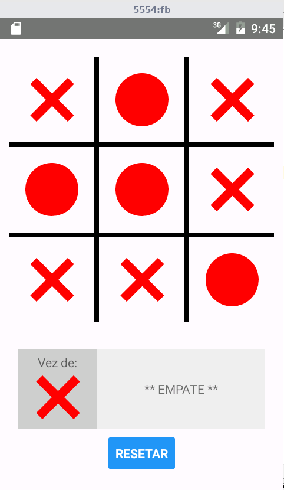
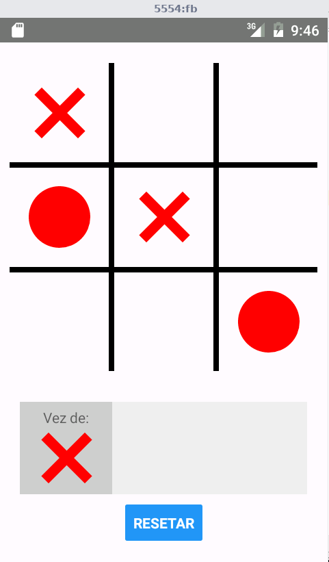

#Jogo da velha
*Baseado no jogo da velha do curso React-Native do zero ao profissional*

**Descrição:**
No curso, o professor demonstra como criar um jogo da velha, entretanto, o jogador joga contra si próprio.

Neste programa que adaptei do curso, o jogador joga contra o computador.

Divirta-se!!!

